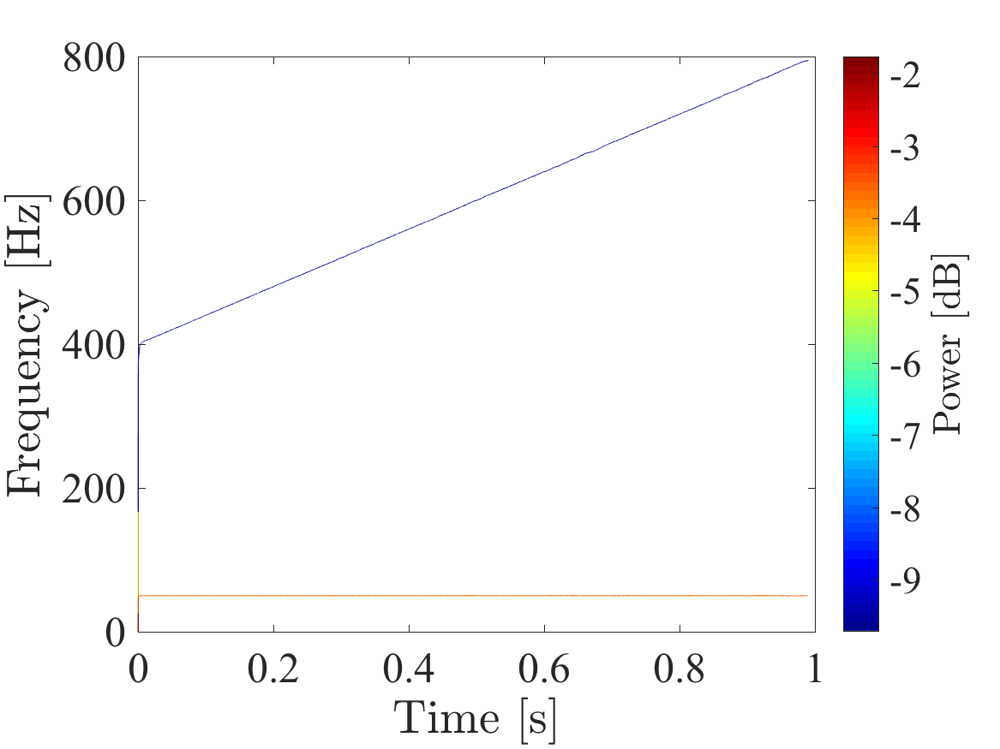

# Academic Hilbert-Huang transform
A light version of Signal Analysis Lab's Hilbert-Huang Transform software for Matlab.

## How to use this software?

There are two essential functions to the hht code. It is the `emd(·)` and the `hilbertSpectrum(·)`. The `emd(·)` function decomposes a one-dimensional array down to the fewest monocomponents *c*<sub>*i*</sub>(*t*) and one monotonic function *r*(*t*) that is needed to describe it. 

## Example

Lets considering the equation

  *v(t)* = sin(*ω<sub>0</sub> t*) + 0.5 cos(*ω<sub>1</sub> t*<sup>2</sup>)

It is shown in the figure below


### Empirical Mode Decomposition
As shown in the example code, we can decompose the voltage waveform *v(t)* using

```matlab
[intrinsicModeFunctions, res] = emd(voltageWaveform);
```

This will decompose the voltage waveform _v(t)_ down to two intrinsic mode functions (IMFs) and a residue so that

_v(t)_ = _c<sub>i</sub>(t)_ + _r(t)_

where _c<sub>i</sub>(t)_ is IMF number _i_ and _r(t)_ is the residue. The IMFs and residue of the example waveform are shown in the figure below.


### Hilbert Spectrum
The IMFs can be visualized using a Hilbert Spectrum. In the Hilbert Spectrum shows the instantaneous frequency _f(t)_ the frequency components power (amplitude squared) as a function of time. To use the Hilbert Spectrum function write
```Matlab
medianFilterLength = 0.02 * samplingFrequency;
hilbertSpectrum(intrinsicModeFunctions, samplingFrequency, medianFilterLength)
```
where the `medianFilterLength` is the length of a median filter used to remove artifacts. In this example, the filter length is 2 % of the sampling rate. The figure below shows the Hilbert Spectrum of the example waveform _v(t)_.



# TODO:
- [x] Documentation
- [x] FixedEMD
- [ ] Ensure that residue output are correct
