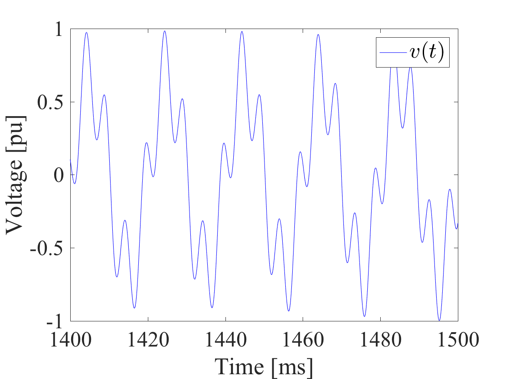
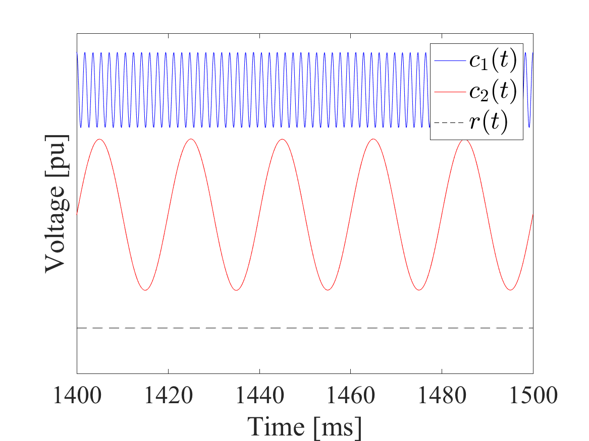

# Academic Hilbert-Huang transform
A light version of Signal Analysis Lab's Hilbert-Huang Transform software for matlab.

## How to use this software?

There are two essential functions to the hht code. It is the emd(·) and the hilbertSpectrum(·). The emd(·) function decomposes an one-dimentional array down to the fewest monocomponents *c*<sub>*i*</sub>(*t*) and one monotonic function *r*(*t*) that is needed to describe it. 

## Example

Lets considering the the equation

*v(t)* = sin(*ω<sub>0</sub> t*) + 0.5 cos(*ω<sub>1</sub> t*<sup>2</sup>)

It is shown in the figure below



As shown in the example code, we can decompose the voltage waveform *v(t)* using

```matlab
[intrinsicModeFunctions, res] = emd(voltageWaveform);
```

This will decompose the voltagewaveform _v(t)_ down to two intrinsic mode functions (IMFs) and a residue so that

_v(t)_ = _c<sub>i</sub>(t)_ + _r(t)_

where _c<sub>i</sub>(t)_ is IMF number _i_ and _r(t)_ is the residue. The IMFs and residue of the example waveform is shown in the figure below.


